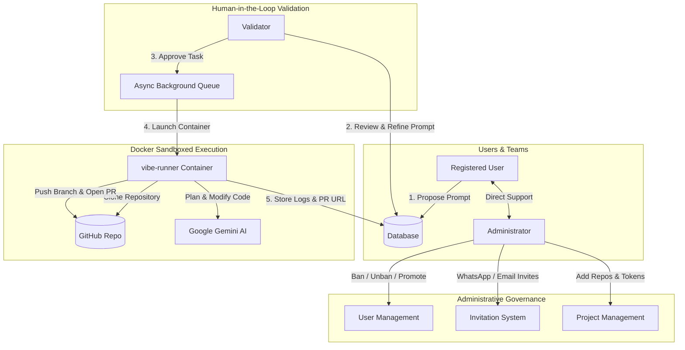

# Vibe Manager AI 🚀

[](https://fastapi.tiangolo.com)
[](https://nextjs.org)
[](https://react.dev)
[](https://www.docker.com)
[](https://ai.google.dev/)
[](https://docs.github.com/rest)

**Vibe Manager AI** is a collaborative software development platform where registered users propose feature modifications and bug fixes using natural language prompts. Every prompt undergoes human-in-the-loop review by qualified **Validators** before being autonomously executed inside an **isolated Docker sandbox**. The AI agent (powered by **Google Gemini**) alters the codebase, formulates a semantic commit, and automatically opens a Pull Request on GitHub.

---

## 📑 Complete Documentation Index

- 📘 [**User Requirements Specification (URS)**](USER_REQUIREMENTS.md): Formal specification of user personas, functional requirements (FR-01 to FR-12), non-functional requirements, and Gherkin acceptance criteria.
- 🏛️ [**System Architecture & Design**](docs/ARCHITECTURE.md): Detailed multi-tier diagram, ephemeral Docker volume sandboxing, prompt synthesis pipeline, and database relationships.
- 🔌 [**REST API & WebSocket Reference**](docs/API_REFERENCE.md): Exhaustive endpoint directory, request/response schemas, error definitions, and real-time chat protocol.

---

## 🌟 Key Capabilities

1. **User Prompt Studio (`/dashboard`)**:
   - Dynamic project selector listing configured GitHub repositories.
   - Rich prompt authoring interface supporting multiple consecutive requests.
   - Real-time task tracking across states (`PENDING`, `APPROVED`, `RUNNING`, `COMPLETED`, `REJECTED`, `FAILED`).
   - Direct links to created GitHub Pull Requests and execution log viewers.

2. **Validator Review Desk (`/validator`)**:
   - Filterable workbench for reviewing pending community proposals.
   - **Inline prompt editor**: Refine, augment, or correct user instructions before dispatching to the AI.
   - **Accept & Enqueue**: Dispatches tasks immediately to the asynchronous Docker queue worker.
   - **Reject**: Mandates an explanation to inform the submitter of rejection rationale.

3. **Ephemeral Docker Sandbox Runner (`/runner`)**:
   - **Blast Radius Limitation**: All Git clones, AI executions, and file modifications occur inside an isolated Docker container (`vibe-runner:latest`).
   - Limits: 2GB memory cap, 300s timeout, isolated volume mounts, non-root execution.
   - Autonomous pipeline:
     1. Shallow clones the target repository branch.
     2. Analyzes repository tree and system rules.
     3. Queries **Google Gemini** for deterministic file changes and commit metadata.
     4. Stages and commits changes on branch `vibe/task-{id}-{hash}`.
     5. Pushes branch and opens a Pull Request via GitHub REST API.

4. **Administrator Console (`/admin`)**:
   - User governance: Ban, readmit, and grant/revoke the **Validator** role.
   - **Invitation Engine**: Generates secure codes (`VIBE-XXXX`) and token links with one-click sharing for **WhatsApp** (`https://wa.me/?text=...`) and **Email** (`mailto:...`).
   - Project repository manager: Add/edit GitHub repos, default branches, and Personal Access Tokens (PAT).
   - Metrics dashboard: Live counters for users, pending prompts, running containers, and opened PRs.

5. **Integrated Real-Time Chat (`/chat`)**:
   - Direct, bi-directional communication between users and the Administrator.
   - Backed by low-latency **WebSockets** with automatic REST polling fallback.

---

## 🏗️ Architecture Overview



---

## 🚀 Quick Start: Unified Stack Management

The platform is organized into a single managed **Docker Compose Stack** with a built-in reverse proxy gateway (Nginx), unified networking (`vibe_stack_network`), persistent volume storage (`vibe_db_data`), and one-click management scripts.

### Launching the Stack

**Using the Stack Manager Script (Windows):**
```powershell
.\stack up           # Or: .\stack.bat up / .\stack.ps1 up
```

**Using Standard Docker Compose:**
```powershell
docker-compose up -d --build
```

### Stack Management Commands

| Command | Action |
| :--- | :--- |
| `.\stack up` | Builds and launches all stack containers in background |
| `.\stack down` | Stops and tears down the stack cleanly |
| `.\stack status` | Shows container status, healthcheck states, and mapped ports |
| `.\stack logs` | Streams live logs from all containers (or `.\stack logs backend`) |
| `.\stack restart` | Restarts all active services |
| `.\stack reset` | Stops the stack and wipes persistent database volumes |

---

## 🌐 Unified Single-Port Entrypoint

Thanks to the integrated **Gateway (Reverse Proxy)** on port `80`, you can access everything through a single clean URL without worrying about separate ports or CORS:

| Service | Unified URL (Port 80) | Direct Fallback URL |
| :--- | :--- | :--- |
| **Web Interface (Next.js)** | [http://localhost](http://localhost) | [http://localhost:3000](http://localhost:3000) |
| **API Health & Endpoints** | [http://localhost/api/health](http://localhost/api/health) | [http://localhost:8000/api/health](http://localhost:8000/api/health) |
| **Interactive API Docs** | [http://localhost/docs](http://localhost/docs) | [http://localhost:8000/docs](http://localhost:8000/docs) |
| **WebSocket Real-time Chat** | `ws://localhost/api/chat/ws` | `ws://localhost:8000/api/chat/ws` |

---

## 💻 Local Development Setup

### 1. Backend (FastAPI + Python 3.12)
```powershell
cd backend
python -m venv .venv
.\.venv\Scripts\activate      # On Linux/Mac: source .venv/bin/activate
pip install -r requirements.txt
uvicorn app.main:app --reload --port 8000
```

### 2. Frontend (Next.js 15 + React 19)
```powershell
cd frontend
npm.cmd install              # On Linux/Mac: npm install
npm.cmd run dev              # On Linux/Mac: npm run dev
```

Visit [http://localhost:3000](http://localhost:3000) in your browser.

---

## 🔑 Default Initial Credentials

When launched for the first time, the database automatically provisions the default Administrator account and a welcome invitation code:

| Entity | Value | Notes |
| :--- | :--- | :--- |
| **Admin Email** | `admin@vibemanager.ai` | Full platform access |
| **Admin Password** | `Admin1234!` | Configurable via `DEFAULT_ADMIN_PASSWORD` |
| **Welcome Invite Code** | `VIBE-WELCOME` | For manual code entry |
| **Direct Invite Link** | `http://localhost:3000/register?invite=welcome-token-2026` | Instant registration link |

---

## ⚙️ Environment Variables Reference

Create a `.env` file in the project root:

```env
# Security & Session
SECRET_KEY=vibe-secret-super-key-2026-production
ACCESS_TOKEN_EXPIRE_MINUTES=10080

# Database Connection (SQLite local, PostgreSQL for production)
DATABASE_URL=sqlite+aiosqlite:///./vibe_manager.db

# Default Seeded Admin
DEFAULT_ADMIN_EMAIL=admin@vibemanager.ai
DEFAULT_ADMIN_PASSWORD=Admin1234!

# Google Gemini AI
GEMINI_API_KEY=your_gemini_api_key_here
GEMINI_MODEL=gemini-2.5-flash

# Docker Sandbox Runner
DOCKER_RUNNER_IMAGE=vibe-runner:latest
DOCKER_TIMEOUT_SECONDS=300

# Frontend URL
FRONTEND_URL=http://localhost:3000
```

---

## 🧪 Automated Testing

### Backend Integration Tests (`pytest`):
```powershell
cd backend
.\.venv\Scripts\python -m pytest tests -v
```
*Covers end-to-end user registration, invitation validation, validator promotion, prompt drafting, validator inline editing, task approval, queue dispatch, chat messaging, and account banning.*

### Frontend Production Build (`next build`):
```powershell
cd frontend
npm.cmd run build
```
*Validates that all 10 Next.js routes compile statically with 0 TypeScript or linting errors.*

---

## 📄 License
This project is licensed under the MIT License.
