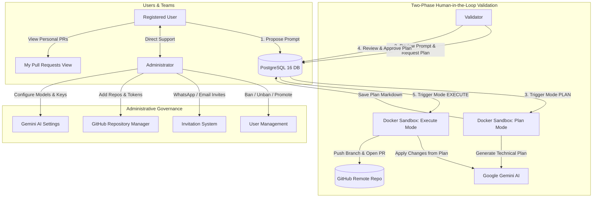

# Vibe Manager AI 🚀

[](https://fastapi.tiangolo.com)
[](https://nextjs.org)
[](https://react.dev)
[](https://www.docker.com)
[](https://ai.google.dev/)
[](https://docs.github.com/rest)

**Vibe Manager AI** is a collaborative software development platform where registered users propose feature modifications and bug fixes using natural language prompts. Every prompt undergoes human-in-the-loop review by qualified **Validators** before being autonomously executed inside an **isolated Docker sandbox**. The AI agent (powered by **Google Gemini**) alters the codebase, formulates a semantic commit, and automatically opens a Pull Request on GitHub.

---

## 📑 Complete Documentation Index

- 📘 [**User Requirements Specification (URS)**](USER_REQUIREMENTS.md): Formal specification of user personas, functional requirements (FR-01 to FR-12), non-functional requirements, and Gherkin acceptance criteria.
- 🏛️ [**System Architecture & Design**](docs/ARCHITECTURE.md): Detailed multi-tier diagram, ephemeral Docker volume sandboxing, prompt synthesis pipeline, and database relationships.
- 🔌 [**REST API & WebSocket Reference**](docs/API_REFERENCE.md): Exhaustive endpoint directory, request/response schemas, error definitions, and real-time chat protocol.

---

## 🌟 Key Capabilities

1. **User Prompt Studio (`/dashboard`)**:
   - Dynamic project selector listing active GitHub repositories.
   - Rich prompt authoring interface supporting multiple consecutive requests.
   - Real-time task tracking across states (`PENDING`, `APPROVED`, `RUNNING`, `COMPLETED`, `REJECTED`, `FAILED`).
   - Clear failure cause diagnosis: prominent red alerts indicating the exact root cause of runner errors.
   - One-click **Live Terminal Console** access for running and completed tasks.

2. **Real-Time Process Monitor & Live Console (`/processes`)**:
   - Live monitoring dashboard showing all sandbox execution tasks in real-time.
   - Active process ticker with elapsed execution counter (`00:42`).
   - Current stage indicators (*Cloning repository*, *Querying Gemini AI*, *Creating Pull Request*).
   - **Live Streaming Terminal Console**: interactive terminal emulator connecting via WebSocket (`/api/processes/{id}/console`) streaming `stdout` & `stderr` in real-time with autoscroll, syntax coloring, clipboard copy, and log file download.

3. **Personal Pull Requests Dashboard (`/pull-requests`)**:
   - Dedicated overview for **all registered users** to track their prompt-generated Pull Requests.
   - Search filter by task ID, branch, or prompt description and project dropdown filter.
   - Copyable branch badge (`vibe/task-{id}-{hash}`) with one-click clipboard copy.
   - Direct link to open the Pull Request on GitHub in a new tab.
   - Modal inspectors with live terminal logs.

4. **Validator Review Desk (`/validator`)**:
   - **Flujo de Trabajo en 2 Fases (Human-in-the-loop)**:
     - **Fase 1 (Pestaña Prompts Pendientes)**: Revisa las solicitudes de los usuarios, realiza ajustes técnicos al prompt y aprueba la generación del plan.
     - **Fase 2 (Pestaña Planes de Implementación)**: Inspecciona el plan técnico generado de forma aislada por Gemini en Docker (`## Objetivo`, `## Archivos Afectados`, `## Pasos Técnicos`). Aprueba el plan para ejecutar el código o rechaza con observaciones.
   - **Inline prompt editor**: Refina directrices técnicas antes de solicitar el plan.
   - **Visualizador estructurado de planes**: Renderizado Markdown claro con archivos afectados y pasos detallados.
   - **Live console inspection**: Inspecciona en tiempo real o en diferido la consola Docker de generación de plan y de ejecución de código.

5. **Ephemeral Docker Sandbox Runner (`/runner`)**:
   - **Blast Radius Limitation**: Todas las consultas a Gemini (elaboración de plan técnico y aplicación de cambios de código), clonados y git pushes se ejecutan dentro del sandbox Docker (`vibe-runner:latest`).
   - Modos de ejecución: `mode="PLAN"` (análisis de repositorio y propuesta de plan estructurado) y `mode="EXECUTE"` (aplicación de cambios, commit y PR).
   - Real-time line-by-line streaming: Asynchronous streaming of stdout/stderr directly to connected WebSockets without blocking.
   - Limits: 2GB memory cap, 300s timeout, non-root execution, network limited to GitHub & Google AI APIs.
   - Decoupled payload via base64 environment encoding (`TASK_PAYLOAD_B64`) and stdout delimiter streaming (`===VIBE_RESULT_START===`).

6. **Administrator Console (`/admin`)**:
   - User governance: Ban, readmit, and grant/revoke the **Validator** role.
   - **Invitation Engine**: Generates secure codes (`VIBE-XXXX`) and token links with one-click sharing for **WhatsApp** and **Email**.
   - **GitHub Repositories Manager & Editor**: View all repositories, search/filter, modify repository parameters (Name, URL, default branch, PAT, AI system rules), and quickly toggle repository active/paused status.
   - **Google Gemini AI Settings**: Hot-swap Gemini API Keys and select active AI models (`gemini-3.6-flash`, `gemini-1.5-flash`, `gemini-1.5-pro`, `gemini-2.5-flash`).
   - Metrics dashboard: Live counters for users, pending prompts, running containers, and opened PRs.

7. **Integrated Real-Time Chat (`/chat`)**:
   - Direct, bi-directional communication between users and the Administrator.
   - Backed by low-latency **WebSockets** with automatic REST polling fallback.

---

## 🏗️ Architecture Overview



---

## 🚀 Quick Start: Unified Stack Management

The platform is organized into a single managed **Docker Compose Stack** with an integrated reverse proxy gateway (Nginx), dedicated persistent **PostgreSQL 16** database (`vibe-db` with volume `vibe_postgres_data`), unified networking (`vibe_stack_network`), and one-click management scripts.

### Launching the Stack

**Using the Stack Manager Script (Windows):**
```powershell
.\stack up           # Or: .\stack.bat up / .\stack.ps1 up
```

**Using Standard Docker Compose:**
```powershell
docker-compose up -d --build
```

### Stack Management Commands

| Command | Action |
| :--- | :--- |
| `.\stack up` | Builds and launches all stack containers in background |
| `.\stack down` | Stops the stack cleanly (**preserves data volumes**) |
| `.\stack status` | Shows container status, healthcheck states, and mapped ports |
| `.\stack logs` | Streams live logs from all containers (or `.\stack logs backend`) |
| `.\stack restart` | Restarts all active services |
| `.\stack backup [file]` | Generates an instant SQL dump of the PostgreSQL database |
| `.\stack restore <file>` | Restores a SQL dump into the PostgreSQL database |
| `.\stack reset` | Stops stack and wipes persistent database volumes (requires confirmation) |

---

## 🌐 Unified Single-Port Entrypoint & Access URLs

Thanks to the integrated **Gateway (Reverse Proxy)** on port `80`, you can access everything through a single clean URL without port conflicts:

| Service / View | Unified URL (Port 80) | Direct Fallback URL |
| :--- | :--- | :--- |
| **Web Interface (Next.js)** | [http://localhost](http://localhost) | [http://localhost:3010](http://localhost:3010) |
| **Mis Pull Requests** | [http://localhost/pull-requests](http://localhost/pull-requests) | [http://localhost:3010/pull-requests](http://localhost:3010/pull-requests) |
| **Prompt Studio (Dashboard)** | [http://localhost/dashboard](http://localhost/dashboard) | [http://localhost:3010/dashboard](http://localhost:3010/dashboard) |
| **Validator Desk** | [http://localhost/validator](http://localhost/validator) | [http://localhost:3010/validator](http://localhost:3010/validator) |
| **Admin Console** | [http://localhost/admin](http://localhost/admin) | [http://localhost:3010/admin](http://localhost:3010/admin) |
| **API Health & Endpoints** | [http://localhost/api/health](http://localhost/api/health) | [http://localhost:8000/api/health](http://localhost:8000/api/health) |
| **Interactive API Docs** | [http://localhost/docs](http://localhost/docs) | [http://localhost:8000/docs](http://localhost:8000/docs) |
| **WebSocket Real-time Chat** | `ws://localhost/api/chat/ws` | `ws://localhost:8000/api/chat/ws` |
| **PostgreSQL 16 Database** | `localhost:5432` | Database: `vibe_manager` (User: `vibe_user`) |

---

## 💻 Local Development Setup

### 1. Backend (FastAPI + Python 3.12)
```powershell
cd backend
python -m venv .venv
.\.venv\Scripts\activate      # On Linux/Mac: source .venv/bin/activate
pip install -r requirements.txt
uvicorn app.main:app --reload --port 8000
```

### 2. Frontend (Next.js 15 + React 19)
```powershell
cd frontend
npm.cmd install              # On Linux/Mac: npm install
npm.cmd run dev              # On Linux/Mac: npm run dev
```

Visit [http://localhost:3010](http://localhost:3010) (or unified [http://localhost](http://localhost)) in your browser.

---

## 🔑 Default Initial Credentials

When launched for the first time, the database automatically provisions the default Administrator account and a welcome invitation code:

| Entity | Value | Notes |
| :--- | :--- | :--- |
| **Admin Email** | `admin@vibemanager.ai` | Full platform access |
| **Admin Password** | `Admin1234!` | Configurable via `DEFAULT_ADMIN_PASSWORD` |
| **Welcome Invite Code** | `VIBE-WELCOME` | For manual code entry |
| **Direct Invite Link** | `http://localhost:3010/register?invite=welcome-token-2026` | Instant registration link |

---

## ⚙️ Environment Variables Reference

Create a `.env` file in the project root:

```env
# Security & Session
SECRET_KEY=vibe-secret-super-key-2026-production
ACCESS_TOKEN_EXPIRE_MINUTES=10080

# PostgreSQL Configuration (Persistent Docker Database)
POSTGRES_DB=vibe_manager
POSTGRES_USER=vibe_user
POSTGRES_PASSWORD=vibe_password_2026_secure

# Database URL:
# For Docker Compose (PostgreSQL 16):
DATABASE_URL=postgresql+asyncpg://vibe_user:vibe_password_2026_secure@db:5432/vibe_manager
# For Standalone Local Dev (SQLite):
# DATABASE_URL=sqlite+aiosqlite:///./data/vibe_manager.db

# Default Seeded Admin
DEFAULT_ADMIN_EMAIL=admin@vibemanager.ai
DEFAULT_ADMIN_PASSWORD=Admin1234!

# Google Gemini AI
GEMINI_API_KEY=your_gemini_api_key_here
GEMINI_MODEL=gemini-3.6-flash

# GitHub Fallback Token (optional)
GITHUB_TOKEN=your_github_pat_here

# Docker Sandbox Runner
DOCKER_RUNNER_IMAGE=vibe-runner:latest
DOCKER_TIMEOUT_SECONDS=300

# Frontend URL
FRONTEND_URL=http://localhost:3010
```

---

## 🧪 Automated Testing

### Backend Integration Tests (`pytest`):
```powershell
docker exec vibe-backend pytest tests/test_api.py -v
```
*Covers end-to-end user registration, invitation validation, validator promotion, project catalog, prompt submission, validator inline editing, task approval, Docker queue dispatch, personal PR retrieval, chat messaging, and account banning.*

### Frontend Production Build (`next build`):
```powershell
cd frontend
npm.cmd run build
```
*Validates that all 11 Next.js routes (including `/pull-requests`) compile statically with 0 TypeScript or linting errors.*

---

## 📄 License
This project is licensed under the MIT License.
