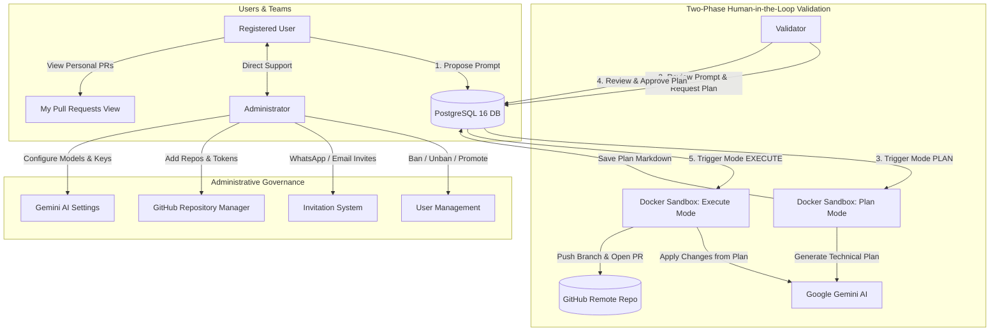
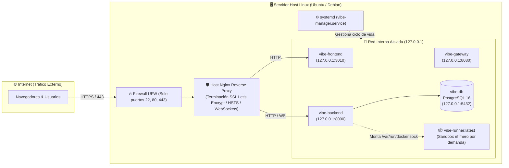

# Vibe Manager AI 🚀

[](https://fastapi.tiangolo.com)
[](https://nextjs.org)
[](https://react.dev)
[](https://www.docker.com)
[](https://ai.google.dev/)
[](https://docs.github.com/rest)

**Vibe Manager AI** is a collaborative software development platform where registered users propose feature modifications and bug fixes using natural language prompts. Every prompt undergoes human-in-the-loop review by qualified **Validators** before being autonomously executed inside an **isolated Docker sandbox**. The AI agent (powered by **Google Gemini**) alters the codebase, formulates a semantic commit, and automatically opens a Pull Request on GitHub.

---

## 📑 Complete Documentation Index

- 📘 [**User Requirements Specification (URS)**](USER_REQUIREMENTS.md): Formal specification of user personas, functional requirements (FR-01 to FR-12), non-functional requirements, and Gherkin acceptance criteria.
- 🏛️ [**System Architecture & Design**](docs/ARCHITECTURE.md): Detailed multi-tier diagram, ephemeral Docker volume sandboxing, prompt synthesis pipeline, and database relationships.
- 🔌 [**REST API & WebSocket Reference**](docs/API_REFERENCE.md): Exhaustive endpoint directory, request/response schemas, error definitions, and real-time chat protocol.

---

## 🌟 Key Capabilities

1. **User Prompt Studio (`/dashboard`)**:
   - Dynamic project selector listing active GitHub repositories.
   - Rich prompt authoring interface supporting multiple consecutive requests.
   - Real-time task tracking across states (`PENDING`, `APPROVED`, `RUNNING`, `COMPLETED`, `REJECTED`, `FAILED`).
   - Clear failure cause diagnosis: prominent red alerts indicating the exact root cause of runner errors.
   - One-click **Live Terminal Console** access for running and completed tasks.

2. **Real-Time Process Monitor & Live Console (`/processes`)**:
   - Live monitoring dashboard showing all sandbox execution tasks in real-time.
   - Active process ticker with elapsed execution counter (`00:42`).
   - Current stage indicators (*Cloning repository*, *Querying Gemini AI*, *Creating Pull Request*).
   - **Live Streaming Terminal Console**: interactive terminal emulator connecting via WebSocket (`/api/processes/{id}/console`) streaming `stdout` & `stderr` in real-time with autoscroll, syntax coloring, clipboard copy, and log file download.

3. **Personal Pull Requests Dashboard (`/pull-requests`)**:
   - Dedicated overview for **all registered users** to track their prompt-generated Pull Requests.
   - Search filter by task ID, branch, or prompt description and project dropdown filter.
   - Copyable branch badge (`vibe/task-{id}-{hash}`) with one-click clipboard copy.
   - Direct link to open the Pull Request on GitHub in a new tab.
   - Modal inspectors with live terminal logs.

4. **Validator Review Desk (`/validator`)**:
   - **Flujo de Trabajo en 2 Fases (Human-in-the-loop)**:
     - **Fase 1 (Pestaña Prompts Pendientes)**: Revisa las solicitudes de los usuarios, realiza ajustes técnicos al prompt y aprueba la generación del plan.
     - **Fase 2 (Pestaña Planes de Implementación)**: Inspecciona el plan técnico generado de forma aislada por Gemini en Docker (`## Objetivo`, `## Archivos Afectados`, `## Pasos Técnicos`). Aprueba el plan para ejecutar el código o rechaza con observaciones.
   - **Inline prompt editor**: Refina directrices técnicas antes de solicitar el plan.
   - **Visualizador estructurado de planes**: Renderizado Markdown claro con archivos afectados y pasos detallados.
   - **Live console inspection**: Inspecciona en tiempo real o en diferido la consola Docker de generación de plan y de ejecución de código.

5. **Ephemeral Docker Sandbox Runner (`/runner`)**:
   - **Blast Radius Limitation**: Todas las consultas a Gemini (elaboración de plan técnico y aplicación de cambios de código), clonados y git pushes se ejecutan dentro del sandbox Docker (`vibe-runner:latest`).
   - Modos de ejecución: `mode="PLAN"` (análisis de repositorio y propuesta de plan estructurado) y `mode="EXECUTE"` (aplicación de cambios, commit y PR).
   - Real-time line-by-line streaming: Asynchronous streaming of stdout/stderr directly to connected WebSockets without blocking.
   - Limits: 2GB memory cap, 300s timeout, non-root execution, network limited to GitHub & Google AI APIs.
   - Decoupled payload via base64 environment encoding (`TASK_PAYLOAD_B64`) and stdout delimiter streaming (`===VIBE_RESULT_START===`).

6. **Administrator Console (`/admin`)**:
   - User governance: Ban, readmit, and grant/revoke the **Validator** role.
   - **Invitation Engine**: Generates secure codes (`VIBE-XXXX`) and token links with one-click sharing for **WhatsApp** and **Email**.
   - **GitHub Repositories Manager & Editor**: View all repositories, search/filter, modify repository parameters (Name, URL, default branch, PAT, AI system rules), and quickly toggle repository active/paused status.
   - **Google Gemini AI Settings**: Hot-swap Gemini API Keys and select active AI models (`gemini-3.6-flash`, `gemini-1.5-flash`, `gemini-1.5-pro`, `gemini-2.5-flash`).
   - Metrics dashboard: Live counters for users, pending prompts, running containers, and opened PRs.

7. **Integrated Real-Time Chat (`/chat`)**:
   - Direct, bi-directional communication between users and the Administrator.
   - Backed by low-latency **WebSockets** with automatic REST polling fallback.

---

## 🏗️ Architecture Overview



---

## 🚀 Quick Start: Unified Stack Management

The platform is organized into a single managed **Docker Compose Stack** with an integrated reverse proxy gateway (Nginx), dedicated persistent **PostgreSQL 16** database (`vibe-db` with volume `vibe_postgres_data`), unified networking (`vibe_stack_network`), and one-click management scripts.

### Launching the Stack

**Using the Stack Manager Script (Windows):**
```powershell
.\stack up           # Or: .\stack.bat up / .\stack.ps1 up
```

**Using Standard Docker Compose:**
```powershell
docker-compose up -d --build
```

### Stack Management Commands

| Command | Action |
| :--- | :--- |
| `.\stack up` | Builds and launches all stack containers in background |
| `.\stack down` | Stops the stack cleanly (**preserves data volumes**) |
| `.\stack status` | Shows container status, healthcheck states, and mapped ports |
| `.\stack logs` | Streams live logs from all containers (or `.\stack logs backend`) |
| `.\stack restart` | Restarts all active services |
| `.\stack backup [file]` | Generates an instant SQL dump of the PostgreSQL database |
| `.\stack restore <file>` | Restores a SQL dump into the PostgreSQL database |
| `.\stack reset` | Stops stack and wipes persistent database volumes (requires confirmation) |

---

## 🌐 Unified Single-Port Entrypoint & Access URLs

Thanks to the integrated **Gateway (Reverse Proxy)** on port `80`, you can access everything through a single clean URL without port conflicts:

| Service / View | Unified URL (Port 80) | Direct Fallback URL |
| :--- | :--- | :--- |
| **Web Interface (Next.js)** | [http://localhost](http://localhost) | [http://localhost:3010](http://localhost:3010) |
| **Mis Pull Requests** | [http://localhost/pull-requests](http://localhost/pull-requests) | [http://localhost:3010/pull-requests](http://localhost:3010/pull-requests) |
| **Prompt Studio (Dashboard)** | [http://localhost/dashboard](http://localhost/dashboard) | [http://localhost:3010/dashboard](http://localhost:3010/dashboard) |
| **Validator Desk** | [http://localhost/validator](http://localhost/validator) | [http://localhost:3010/validator](http://localhost:3010/validator) |
| **Admin Console** | [http://localhost/admin](http://localhost/admin) | [http://localhost:3010/admin](http://localhost:3010/admin) |
| **API Health & Endpoints** | [http://localhost/api/health](http://localhost/api/health) | [http://localhost:8000/api/health](http://localhost:8000/api/health) |
| **Interactive API Docs** | [http://localhost/docs](http://localhost/docs) | [http://localhost:8000/docs](http://localhost:8000/docs) |
| **WebSocket Real-time Chat** | `ws://localhost/api/chat/ws` | `ws://localhost:8000/api/chat/ws` |
| **PostgreSQL 16 Database** | `localhost:5432` | Database: `vibe_manager` (User: `vibe_user`) |

---

## 💻 Local Development Setup

### 1. Backend (FastAPI + Python 3.12)
```powershell
cd backend
python -m venv .venv
.\.venv\Scripts\activate      # On Linux/Mac: source .venv/bin/activate
pip install -r requirements.txt
uvicorn app.main:app --reload --port 8000
```

### 2. Frontend (Next.js 15 + React 19)
```powershell
cd frontend
npm.cmd install              # On Linux/Mac: npm install
npm.cmd run dev              # On Linux/Mac: npm run dev
```

Visit [http://localhost:3010](http://localhost:3010) (or unified [http://localhost](http://localhost)) in your browser.

---

## 🔑 Default Initial Credentials

When launched for the first time, the database automatically provisions the default Administrator account and a welcome invitation code:

| Entity | Value | Notes |
| :--- | :--- | :--- |
| **Admin Email** | `admin@vibemanager.ai` | Full platform access |
| **Admin Password** | `Admin1234!` | Configurable via `DEFAULT_ADMIN_PASSWORD` |
| **Welcome Invite Code** | `VIBE-WELCOME` | For manual code entry |
| **Direct Invite Link** | `http://localhost:3010/register?invite=welcome-token-2026` | Instant registration link |

---

## ⚙️ Environment Variables Reference

Create a `.env` file in the project root:

```env
# Security & Session
SECRET_KEY=vibe-secret-super-key-2026-production
ACCESS_TOKEN_EXPIRE_MINUTES=10080

# PostgreSQL Configuration (Persistent Docker Database)
POSTGRES_DB=vibe_manager
POSTGRES_USER=vibe_user
POSTGRES_PASSWORD=vibe_password_2026_secure

# Database URL:
# For Docker Compose (PostgreSQL 16):
DATABASE_URL=postgresql+asyncpg://vibe_user:vibe_password_2026_secure@db:5432/vibe_manager
# For Standalone Local Dev (SQLite):
# DATABASE_URL=sqlite+aiosqlite:///./data/vibe_manager.db

# Default Seeded Admin
DEFAULT_ADMIN_EMAIL=admin@vibemanager.ai
DEFAULT_ADMIN_PASSWORD=Admin1234!

# Google Gemini AI
GEMINI_API_KEY=your_gemini_api_key_here
GEMINI_MODEL=gemini-3.6-flash

# GitHub Fallback Token (optional)
GITHUB_TOKEN=your_github_pat_here

# Docker Sandbox Runner
DOCKER_RUNNER_IMAGE=vibe-runner:latest
DOCKER_TIMEOUT_SECONDS=300

# Frontend URL
FRONTEND_URL=http://localhost:3010
```

---

## 🚀 Guía de Despliegue en Producción (Linux / Systemd / Nginx SSL)

Esta sección describe cómo desplegar **Vibe Manager AI** en un servidor de producción dedicado con Linux (Ubuntu 20.04/22.04/24.04 LTS o Debian 11/12), protegiendo la plataforma mediante un proxy inverso **Nginx** con **HTTPS (Let's Encrypt)**, soporte para **WebSockets**, aislamiento de red estricto y arranque automático mediante un servicio **systemd**.



---

### 1. Requisitos Previos de la Máquina Host

| Componente | Requisito Mínimo | Recomendado en Producción | Justificación |
| :--- | :--- | :--- | :--- |
| **Sistema Operativo** | Ubuntu 22.04 LTS / Debian 12 | Ubuntu 24.04 LTS (x86_64) | Compatibilidad completa con Docker Engine y Nginx moderno |
| **CPU** | 2 vCPUs | 4 vCPUs | Compilaciones concurrentes de Next.js y ejecuciones aisladas del runner |
| **Memoria RAM** | 4 GB | 8 GB | Cada tarea en sandbox Docker tiene un límite asignado de hasta 2 GB |
| **Almacenamiento** | 25 GB SSD | 50+ GB NVMe SSD | Imágenes Docker, volúmenes de PostgreSQL y clonados de repositorios |
| **Docker Engine** | Docker 24.0+ | Docker 27.0+ | Gestión de contenedores y aislamiento de procesos |
| **Docker Compose** | Plugin v2 (`docker compose`) | Versión 2.24+ | Soporte para overlays de producción (`-f docker-compose.prod.yml`) |
| **Nginx & Certbot** | Nginx 1.18+ con Certbot | Nginx 1.24+ / `python3-certbot-nginx` | Proxy inverso frontal, compresión gzip, HSTS y SSL automático |

#### ⚠️ Aspectos Críticos a Tener en Cuenta en la Máquina:
1. **Acceso al Docker Socket (`/var/run/docker.sock`):**
   El backend genera dinámicamente contenedores Docker sandbox (`vibe-runner:latest`) para procesar las tareas aprobadas de forma efímera. El usuario del sistema que ejecute los servicios debe pertenecer al grupo `docker`:
   ```bash
   sudo usermod -aG docker $USER
   ```
2. **Construcción Previa del Sandbox Runner:**
   La imagen del runner `vibe-runner:latest` **debe estar compilada localmente en la máquina host** antes de procesar tareas. Si falta, el worker del backend no podrá inicializar los sandboxes.
3. **Conectividad Saliente:**
   El host debe tener acceso saliente a través del puerto 443 hacia:
   - `github.com` y `api.github.com` (para clonado, commits y creación de PRs).
   - `generativelanguage.googleapis.com` (API de Google Gemini).
4. **Aislamiento de Puertos (Seguridad Perimetral):**
   En producción, **nunca** expongas los puertos `5432` (PostgreSQL), `8000` (FastAPI) ni `3010` (Next.js) al exterior. Utiliza siempre el archivo [`docker-compose.prod.yml`](docker-compose.prod.yml) para que queden vinculados exclusivamente a la interfaz local `127.0.0.1`.

---

### 2. Método 1: Despliegue Rápido Automatizado (`deploy/setup-prod.sh`)

Hemos creado un instalador integral para Ubuntu/Debian que realiza todas las comprobaciones y configuraciones automáticamente:

```bash
# 1. Clonar el repositorio en el servidor (ej: en /opt/vibe-manager-ai o en tu home)
git clone https://github.com/emrojo/vibe-manager-ai.git /opt/vibe-manager-ai
cd /opt/vibe-manager-ai

# 2. Conceder permisos de ejecución al instalador
chmod +x deploy/setup-prod.sh

# 3. Ejecutar el asistente de instalación
./deploy/setup-prod.sh
```

**¿Qué hace automáticamente este script?**
- ✅ Verifica e instala dependencias (`docker`, `git`, `nginx`, `certbot`, etc.).
- ✅ Genera claves criptográficas seguras (`SECRET_KEY`, contraseña aleatoria de PostgreSQL) en un archivo `.env`.
- ✅ Compila la imagen de ejecución aislada `vibe-runner:latest`.
- ✅ Compila todas las imágenes del stack en modo producción.
- ✅ Instala y activa la unidad de servicio `systemd` (`/etc/systemd/system/vibe-manager.service`).
- ✅ Configura Nginx en el host (`/etc/nginx/sites-available/vibe-manager.conf`) con soporte completo de WebSockets y cabeceras de seguridad.
- ✅ Inicia la plataforma y te muestra el comando para obtener el certificado SSL con Certbot.

---

### 3. Método 2: Despliegue Manual Paso a Paso

Si prefieres realizar el despliegue de forma manual o sobre una infraestructura personalizada, sigue estos pasos:

#### Paso 1: Configuración de Variables de Entorno (`.env`)
Genera claves seguras y crea tu archivo `.env` en la raíz del proyecto:
```bash
SECRET_KEY=$(openssl rand -hex 32)
POSTGRES_PASS=$(openssl rand -base64 24 | tr -dc 'a-zA-Z0-9' | head -c 24)

cat <<EOF > .env
SECRET_KEY=${SECRET_KEY}
ACCESS_TOKEN_EXPIRE_MINUTES=10080

POSTGRES_DB=vibe_manager
POSTGRES_USER=vibe_user
POSTGRES_PASSWORD=${POSTGRES_PASS}
DATABASE_URL=postgresql+asyncpg://vibe_user:${POSTGRES_PASS}@db:5432/vibe_manager

DEFAULT_ADMIN_EMAIL=admin@vibemanager.ai
DEFAULT_ADMIN_PASSWORD=Admin1234!

GEMINI_API_KEY=tu_gemini_api_key_aqui
GEMINI_MODEL=gemini-3.6-flash

DOCKER_RUNNER_IMAGE=vibe-runner:latest
DOCKER_TIMEOUT_SECONDS=300

FRONTEND_URL=https://tu-dominio.com
EOF
```

#### Paso 2: Compilación de la Imagen Sandbox
```bash
docker build -t vibe-runner:latest ./runner
```

#### Paso 3: Compilación y Puesta en Marcha del Stack
Utiliza el overlay de producción para aislar los puertos a `127.0.0.1`:
```bash
docker compose -f docker-compose.yml -f docker-compose.prod.yml up -d --build
```
> **Nota sobre Migraciones:** En el arranque, el backend ejecuta automáticamente `alembic upgrade head`, aplicando todas las tablas y columnas necesarias sin intervención manual.

#### Paso 4: Configuración de Nginx en el Host
Copia la plantilla de producción y ajusta tu nombre de dominio:
```bash
sudo cp deploy/nginx/vibe-manager.conf /etc/nginx/sites-available/vibe-manager.conf
sudo sed -i "s/your-domain.com/tu-dominio.com/g" /etc/nginx/sites-available/vibe-manager.conf

# Habilitar el sitio en Nginx
sudo ln -s /etc/nginx/sites-available/vibe-manager.conf /etc/nginx/sites-enabled/
sudo rm -f /etc/nginx/sites-enabled/default

# Probar la sintaxis y recargar
sudo nginx -t && sudo systemctl reload nginx
```

#### Paso 5: Certificado SSL Gratuito con Let's Encrypt (Certbot)
```bash
sudo apt install -y certbot python3-certbot-nginx
sudo certbot --nginx -d tu-dominio.com
```
Certbot configurará automáticamente la renovación periódica y forzará la redirección a HTTPS.

#### Paso 6: Configuración del Servicio `systemd`
Para asegurar que el stack se inicie automáticamente tras reinicios del servidor:
```bash
sudo cp deploy/systemd/vibe-manager.service /etc/systemd/system/vibe-manager.service

# Ajustar la ruta del directorio al directorio real de tu instalación
sudo sed -i "s|/opt/vibe-manager-ai|$(pwd)|g" /etc/systemd/system/vibe-manager.service

sudo systemctl daemon-reload
sudo systemctl enable vibe-manager
sudo systemctl start vibe-manager
```

---

### 4. Endurecimiento de Seguridad y Mantenimiento Continuo

#### Configuración del Cortafuegos (UFW)
Cierra todos los puertos innecesarios, manteniendo solo el acceso administrativo por SSH y el tráfico web por Nginx:
```bash
sudo ufw default deny incoming
sudo ufw default allow outgoing
sudo ufw allow 22/tcp    # Puerto SSH
sudo ufw allow 80/tcp    # HTTP (para redirección y ACME challenges)
sudo ufw allow 443/tcp   # HTTPS seguro
sudo ufw enable
```

#### Copias de Seguridad Automáticas de PostgreSQL
Programa una copia diaria de la base de datos añadiendo la siguiente línea al crontab del sistema (`sudo crontab -e`):
```cron
# Copia de seguridad diaria de PostgreSQL a las 03:00 AM con compresión gzip
0 3 * * * /opt/vibe-manager-ai/stack backup /var/backups/vibe_db_$(date +\%F).sql.gz > /dev/null 2>&1
```

#### Mantenimiento y Limpieza de Docker
Para evitar acumulación de capas intermedias y contenedores efímeros del runner:
```cron
# Limpieza semanal de imágenes y contenedores huérfanos (domingos a las 04:00 AM)
0 4 * * 0 /usr/bin/docker system prune -f --volumes > /dev/null 2>&1
```

---

## 🧪 Automated Testing

### Backend Integration Tests (`pytest`):
```powershell
docker exec vibe-backend pytest tests/test_api.py -v
```
*Covers end-to-end user registration, invitation validation, validator promotion, project catalog, prompt submission, validator inline editing, task approval, Docker queue dispatch, personal PR retrieval, chat messaging, and account banning.*

### Frontend Production Build (`next build`):
```powershell
cd frontend
npm.cmd run build
```
*Validates that all 11 Next.js routes (including `/pull-requests`) compile statically with 0 TypeScript or linting errors.*

---

## 📄 License
This project is licensed under the MIT License.
