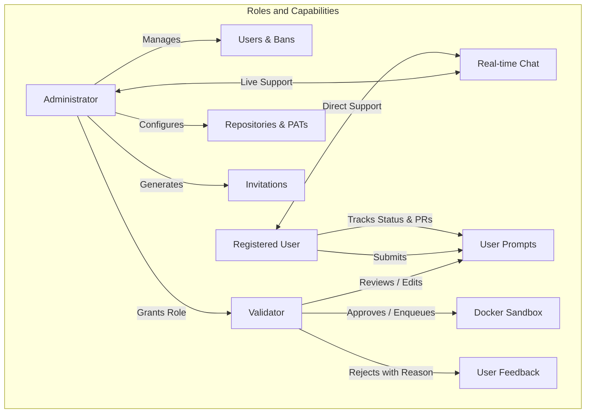
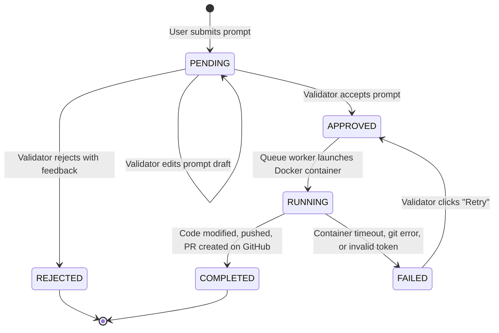

# User Requirements Specification (URS)
## Project: Vibe Manager AI
**Document Version:** 1.0.0  
**Status:** Approved  
**Language:** English  
**Classification:** Product & Technical Specification  

---

## 1. Executive Summary & Vision

### 1.1 Purpose
**Vibe Manager AI** is an enterprise-grade web platform engineered to bridge human creativity and automated software engineering. It enables registered users to propose code modifications to designated web repositories using natural language prompts. To guarantee code quality and security, prompts are reviewed, enriched, and approved by qualified **Validators** before entering an asynchronous execution queue. 

Once approved, an autonomous AI Agent powered by **Google Gemini** executes the prompt within an isolated, ephemeral **Docker sandbox container**. The agent clones the target repository, plans and applies the file-level code modifications, formulates a semantic commit, pushes a dedicated feature branch, and opens a Pull Request (PR) on GitHub.

### 1.2 Core Problem Solved
- **Uncontrolled AI Code Execution:** Running generative AI tools directly on production repositories or host environments risks unintended deletions, security leaks, or broken builds. Vibe Manager AI introduces a **strictly bounded Docker blast radius** where the agent can only alter code within its assigned container workspace.
- **Prompt Ambiguity:** Direct end-user prompts frequently lack architectural context. The **Human-in-the-Loop Validator** role allows experienced engineers to refine prompts prior to execution.
- **Access Control & Traceability:** Free yet controlled registration via invitation tokens (with one-click WhatsApp and Email distribution) prevents open-relay abuse while facilitating easy onboarding.

---

## 2. User Personas and Roles



| Persona / Role | Description | Primary Permissions & Responsibilities |
| :--- | :--- | :--- |
| **Registered User** (`user`) | An authorized team member or community contributor proposing features or bug fixes. | - Register via invitation code or token link.<br>- View project catalog and repository details.<br>- Author and submit multiple prompts.<br>- Track prompt lifecycle in real time (`PENDING` -> `APPROVED` -> `RUNNING` -> `COMPLETED` / `REJECTED`).<br>- Inspect execution logs and open generated GitHub PRs.<br>- Chat 1-on-1 with the Administrator. |
| **Validator** (`validator`) | A senior engineer or QA lead responsible for inspecting and refining prompts. | - All Registered User permissions.<br>- Access the **Validation Desk** (`/validator`).<br>- View pending, running, completed, and rejected tasks.<br>- Edit and augment prompt instructions before approval.<br>- Approve prompts to enqueue them for Docker execution.<br>- Reject prompts with explicit explanatory feedback. |
| **Administrator** (`admin`) | The system operator and platform manager. | - Full access to all platform areas, including the **Admin Console** (`/admin`).<br>- User directory management (ban, unban, grant/revoke validator roles).<br>- Project repository management (add, edit, remove GitHub repos, branches, and PATs).<br>- Generate invitation codes and shareable links (with WhatsApp and Email quick-actions).<br>- Access real-time multi-threaded chat inbox with all users.<br>- View real-time platform metrics and throughput stats. |
| **Automated Runner** (`vibe-runner`) | An ephemeral, non-privileged Docker container agent. | - Clones the repository using the provided GitHub PAT.<br>- Creates branch `vibe/task-{id}-{hash}`.<br>- Interacts with Google Gemini to synthesize code diffs.<br>- Applies changes, commits, pushes branch, and creates GitHub PR. |

---

## 3. Functional Requirements (FR)

### FR-01: User Onboarding & Invitation-Based Registration
- **Description:** The system must restrict account registration to individuals holding a valid invitation code or URL invitation token.
- **Inputs:** User full name, email address, password (minimum 6 characters), and invitation code or URL token.
- **Processing Logic:**
  1. The registration page automatically inspects URL search parameters (`?invite=<token>` or `?code=<code>`).
  2. If a token or code is present, it is verified against the backend endpoint `/api/auth/verify-invite`.
  3. The invitation must be active, unexpired, and below its `max_uses` threshold (or set to `-1` for unlimited uses).
  4. If valid, the field displays visual confirmation.
  5. Upon submission, a new account is provisioned with role `user`, the invitation's `used_count` is incremented, and a JWT session token is returned.
- **Special Case (First User Bootstrap):** If the database contains zero users, the system allows the first registrant to become `admin` without requiring an invitation code.

### FR-02: Authentication and Role-Based Access Control (RBAC)
- **Description:** All endpoints and views must enforce strict authentication and authorization checks.
- **Requirements:**
  - Passwords must be hashed using `bcrypt` with salt generation.
  - Authentication tokens must follow JWT standard with configurable expiration (default: 7 days).
  - Banned users (`is_banned: true`) must be rejected at login and prohibited from accessing any authenticated endpoint (HTTP 403 Forbidden).
  - Protected views (`/validator` and `/admin`) must redirect unauthorized users back to `/dashboard`.

### FR-03: Project Selection and Prompt Authoring
- **Description:** Registered users must be able to draft and dispatch multiple prompt requests targeting specific configured repositories.
- **Inputs:** Target project selection (dropdown select), prompt text (multi-line textarea).
- **Processing Logic:**
  - The UI populates available active projects from `/api/projects`.
  - The user enters detailed instructions for the AI.
  - Multiple prompts can be submitted sequentially; each submission creates an independent `PromptTask` record in the database with status `PENDING`.

### FR-04: Real-Time Prompt Lifecycle Tracking
- **Description:** Users must have immediate visibility into the status of their submitted prompts.
- **Task Lifecycle States:**
  1. `PENDING`: Stored in database, awaiting human review by a Validator.
  2. `APPROVED`: Accepted by a Validator, enqueued for sandbox processing.
  3. `RUNNING`: Currently executing inside the ephemeral Docker sandbox container.
  4. `COMPLETED`: Code applied, committed, pushed, and GitHub Pull Request opened successfully.
  5. `REJECTED`: Declined by a Validator, with an explanatory message visible to the submitter.
  6. `FAILED`: Runner encountered an execution error (e.g., clone error, token failure), with logs inspectable in a modal.
- **Polling & Updates:** The dashboard automatically refreshes data every 10 seconds and provides a manual refresh trigger.

### FR-05: Validator Desk & Inline Prompt Revision
- **Description:** Validators must be capable of inspecting prompts and modifying their instructions prior to execution.
- **Functionality:**
  - Displays pending prompts categorized by project and author.
  - Provides an inline editable code editor/textarea allowing the validator to correct syntax, clarify edge cases, or enforce architectural rules.
  - A "Guardar borrador" (Save draft) button persists prompt revisions via `PUT /api/validation/tasks/{id}/edit`.

### FR-06: Task Validation Decision (Acceptance & Rejection)
- **Acceptance:**
  - Clicking "Aceptar y Encolar a Docker" sets the status to `APPROVED`, records the validator's ID and timestamp, saves any edited prompt content, and dispatches the task to the asynchronous queue worker (`queue_worker.py`).
- **Rejection:**
  - Clicking "Rechazar" opens a modal prompting for the rejection rationale.
  - Setting status to `REJECTED` permanently records the `rejection_reason` so the author can understand why the request was turned down.

### FR-07: Docker Sandboxing & Blast Radius Containment
- **Description:** All automated code modifications and Git operations must execute inside an isolated Docker container to prevent host compromise.
- **Sandboxing Specifications:**
  - Container image: `vibe-runner:latest` based on `python:3.12-slim`.
  - Memory limit: 2GB maximum (`--memory 2g`).
  - Execution timeout: 300 seconds maximum (`DOCKER_TIMEOUT_SECONDS`).
  - Temporary volume isolation: The container operates on an isolated host temporary directory (`/runner_workspace`) mounted as a volume.
  - Ephemeral credential injection: The GitHub Personal Access Token (PAT) and Gemini API Key are supplied only to the running container process via memory/config and are never written into repo source files.
  - Fault-Tolerant Fallback: If the Docker daemon is unreachable (e.g., in minimal dev environments), the runner gracefully falls back to an isolated subprocess worker with full logging.

### FR-08: AI Agent Code Synthesis (Google Gemini)
- **Description:** The runner must interpret the validated prompt and synthesize accurate code modifications.
- **Workflow:**
  1. Clones repository branch shallowly (`--depth 1`).
  2. Traverses and inspects the repository file tree.
  3. Constructs a prompt containing repository structure, project prompt rules, and validated user instructions.
  4. Invokes Google Gemini (`gemini-2.5-flash` or configured model) requesting structured JSON containing:
     - `commit_message`: Conventional commit header and description.
     - `pr_title`: Concise pull request headline.
     - `pr_body`: Markdown breakdown of changes and affected components.
     - `changes`: Array of `{ path, action: "CREATE" | "MODIFY" | "DELETE", content }`.
  5. Applies changes directly to the checked-out workspace.

### FR-09: Automated GitHub Branching & Pull Request Opening
- **Description:** Upon applying changes, the runner must commit, push, and open a PR.
- **Workflow:**
  1. Configures local git identity (`Vibe Manager AI Bot <bot@vibemanager.ai>`).
  2. Creates new branch: `vibe/task-{task_id}-{random_hex}`.
  3. Stages all changes (`git add -A`) and commits with the AI-formulated commit message.
  4. Pushes the branch to GitHub using authenticated PAT URL.
  5. Calls the GitHub REST API (`POST https://api.github.com/repos/{owner}/{repo}/pulls`).
  6. Captures the generated PR URL and PR number, saving them to the database for display on user and validator dashboards.

### FR-10: Administration Console (User & Role Governance)
- **Description:** Administrators must have total operational control over users and access.
- **Features:**
  - **User Directory:** Paginated list of users showing name, email, role, status, and join date.
  - **Account Suspension (Banning):** One-click toggle to ban a user (`is_banned: true`), terminating active access. Re-admission unbans the user instantly.
  - **Role Promotion:** Promote any standard `user` to `validator`, or demote back to `user`. Self-demotion of the active admin is blocked for safety.
  - **Direct Chat Link:** Quick-action button on each user row to initiate a chat thread.

### FR-11: Invitation Code Generation & One-Click Sharing
- **Description:** Administrators must be able to generate and distribute invitation credentials effortlessly.
- **Features:**
  - Configurable maximum uses (e.g., 1, 5, 20, or `-1` for unlimited) and expiration in days.
  - Automatically generates human-readable code (e.g., `VIBE-A1B2C3`) and secure URL token.
  - **Copy Link Button:** Copies `https://<domain>/register?invite=<token>` to clipboard.
  - **WhatsApp Button:** Launches `https://wa.me/?text=<encoded_invite_message>` to share instantly via WhatsApp mobile or web.
  - **Email Button:** Launches `mailto:?subject=<subject>&body=<body>` for rapid email distribution.
  - **Revocation:** Ability to deactivate an invitation at any time.

### FR-12: Real-Time Bidirectional Chat System
- **Description:** Direct messaging channel between platform users and the Administrator.
- **Features:**
  - Multi-threaded inbox for Administrators: displays all users, unread badge counters, and recent message snippets.
  - Dedicated support thread for Users: allows asking questions or receiving feedback from the Administrator.
  - Dual delivery mechanism: Instant push via WebSockets (`/api/chat/ws?token=<jwt>`) with REST fallback (`/api/chat/messages`).

---

## 4. Non-Functional Requirements (NFR)

| ID | Category | Requirement Description |
| :--- | :--- | :--- |
| **NFR-01** | **Security & Sandboxing** | The AI model and code modification scripts must never have unmediated write access to the host file system. All executions must be isolated in Docker containers with memory limits (2GB) and non-root user permissions where applicable. |
| **NFR-02** | **Secret Management** | GitHub Personal Access Tokens (PATs) and Gemini API Keys must never be written to Git history, committed into repositories, or leaked into client-side JavaScript bundles. |
| **NFR-03** | **Performance & Concurrency** | The backend API must remain responsive (<100ms for standard CRUD) regardless of long-running Docker tasks. All task execution must occur asynchronously in background workers. |
| **NFR-04** | **Observability** | Every task execution must capture full standard output (`stdout`) and standard error (`stderr`) logs, persisting them in the database for post-run debugging. |
| **NFR-05** | **Responsive Design** | The web interface (Next.js 15 + Tailwind CSS) must be fully responsive across desktop, tablet, and mobile browsers. |
| **NFR-06** | **Graceful Degradation** | If Docker is temporarily unavailable on a developer workstation, the system must log a warning and utilize an isolated subprocess worker rather than failing catastrophically. |

---

## 5. State Transition Model



---

## 6. Acceptance Criteria (Gherkin Scenarios)

### Scenario 1: User Registration via WhatsApp Invitation Link
```gherkin
Given a user clicks an invitation link received via WhatsApp containing "?invite=vibe-token-xyz"
When the user navigates to the registration page
Then the invitation code field is automatically populated and verified with a green checkmark
And when the user provides their name, email, and password and clicks "Registrarme"
Then an account is created with role "user"
And the user is automatically logged in and redirected to "/dashboard".
```

### Scenario 2: Validator Modifies and Approves a Prompt
```gherkin
Given a user has submitted a prompt for the "Corporate Portal" project
When a Validator accesses "/validator"
Then the prompt appears under the "Pendientes" tab
When the Validator edits the prompt to include specific CSS guidelines
And clicks "Aceptar y Encolar a Docker"
Then the prompt status transitions to "APPROVED"
And the background worker launches the Docker runner
And the user's dashboard reflects the transition to "RUNNING" and ultimately "COMPLETED" with the GitHub PR link.
```

### Scenario 3: Banned User Login Attempt
```gherkin
Given an Administrator has clicked "Banear" on a user account in "/admin"
When the banned user attempts to log in with valid credentials
Then the system returns an HTTP 403 Forbidden status
And displays "Tu cuenta ha sido suspendida por el administrador."
And no access token is issued.
```

### Scenario 4: Ephemeral Docker Execution Blast Radius
```gherkin
Given an approved task with id 42
When the docker runner orchestrates the container
Then a fresh temporary workspace directory is created on the host
And the container mounts only that directory to "/runner_workspace"
And the container runs with a memory limit of 2GB and a 300-second timeout
And the repository is cloned, modified, committed, and pushed on branch "vibe/task-42-xxxx"
And the resulting Pull Request URL is saved to the database.
```
