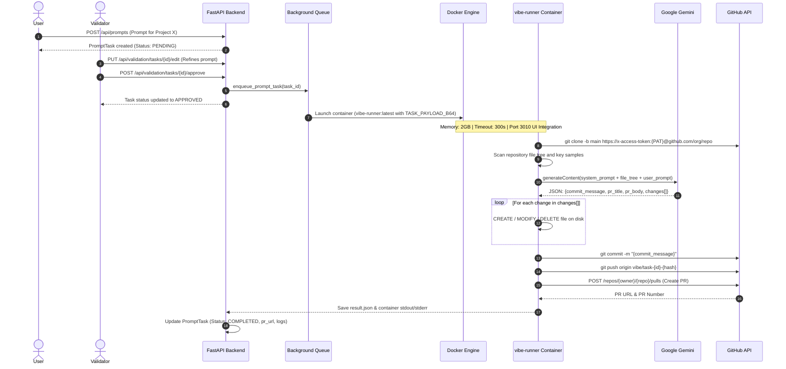
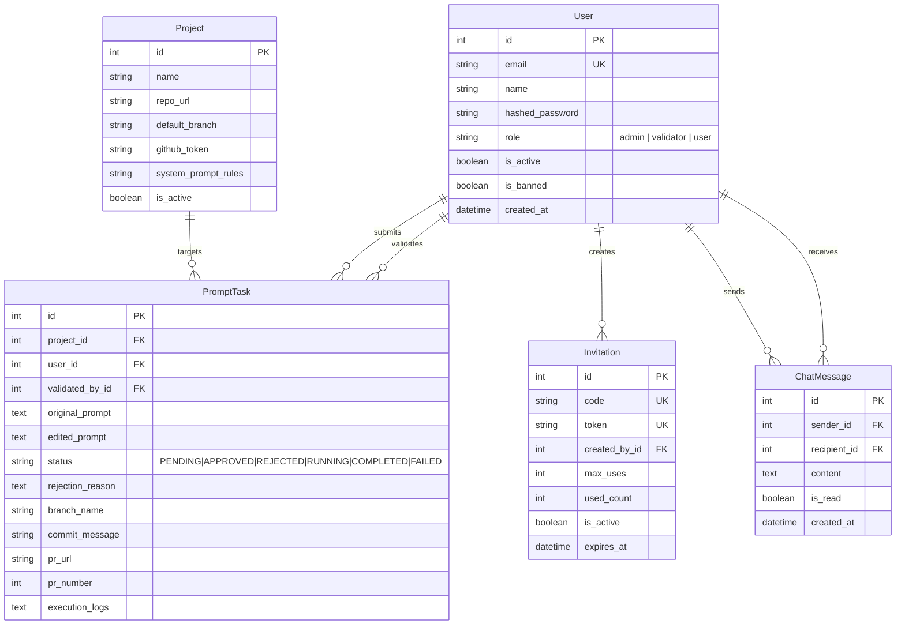

# System Architecture & Technical Design
## Vibe Manager AI

This document provides an in-depth architectural breakdown of **Vibe Manager AI**, detailing the structural layers, Docker sandboxing mechanisms, AI agent synthesis pipeline, and real-time communication protocols.

---

## 1. High-Level Architecture

Vibe Manager AI is architected as a modular, decoupled system composed of four major layers:

```mermaid
flowchart TB
    subgraph Presentation Layer [Frontend - Next.js 15 & React 19]
        UI_User[User Dashboard / Prompt Studio]
        UI_Val[Validator Desk & Inline Editor]
        UI_Adm[Admin Console & User Governance]
        UI_Chat[Real-Time WebSocket Chat Interface]
    end

    subgraph Application Layer [Backend - FastAPI & Python 3.12]
        API[FastAPI REST API Engine]
        AUTH[JWT & Argon2/Bcrypt Security Guard]
        WS[WebSocket Connection Manager]
        QUEUE[Async Background Task Queue]
    end

    subgraph Persistence Layer [Storage & Database]
        DB[(PostgreSQL 16 Service - vibe-db)]
        VOL[(Docker Volume - vibe_postgres_data)]
        SQLITE[(SQLite Fallback Engine)]
    end

    subgraph Sandbox Layer [Docker Engine Isolation]
        DOCKER_MGR[Docker Runner Orchestrator]
        CONTAINER[Isolated Container - vibe-runner:latest]
        AGENT[AI Synthesis Agent - Google Gemini]
        GIT[Git CLI & GitHub REST Client]
    end

    subgraph External Cloud Services
        GEMINI_API[Google Gemini API]
        GITHUB[GitHub API & Git Remote Repositories]
    end

    Presentation Layer <-->|HTTPS REST & WSS| Application Layer
    Application Layer <--> DB
    DB --- VOL
    QUEUE --> DOCKER_MGR
    DOCKER_MGR -->|docker run with base64 payload & resource caps| CONTAINER
    CONTAINER --> AGENT
    AGENT <-->|JSON Structured Schema| GEMINI_API
    CONTAINER --> GIT
    GIT <-->|Clone / Push / Create PR| GITHUB
    CONTAINER -->|Delimited Result JSON over stdout| DOCKER_MGR
```

---

## 2. Component Breakdown

### 2.1 Presentation Layer (`/frontend`)
- **Framework:** Next.js 15 App Router (`src/app`), React 19, TypeScript.
- **Port:** Configured to port `3010` by default (with unified ingress on port `80` through the Nginx gateway).
- **Styling & UI:** Tailwind CSS, Lucide React icons, customized dark slate aesthetic.
- **Client State Management:** `AuthContext` provides session state, reactive token handling, and role-based client-side redirects.
- **Key Modules:**
  - `src/app/pull-requests/page.tsx`: **Personal Pull Requests Dashboard** accessible to all registered users, featuring task/prompt search, project filters, copyable branch badges, direct links to GitHub PRs, code diff previews, and execution log modals.
  - `src/app/dashboard/page.tsx`: Project selection dropdown, prompt textarea, real-time prompt lifecycle table, PR hyperlinks, and execution log viewers.
  - `src/app/validator/page.tsx`: Multi-status filter tabs, dual-view diff (Original prompt vs. Editable prompt), approval and rejection modals.
  - `src/app/admin/page.tsx`: System throughput statistics, user directory, ban/unban toggles, role switches, invitation generator with WhatsApp/Email deep links, **GitHub Repositories Management**, and dynamic **Google Gemini AI configuration**.
  - `src/app/chat/page.tsx`: Multi-channel chat interface with dynamic WebSocket connection detecting port 3010 and REST fallback.

### 2.2 Application Layer (`/backend`)
- **Framework:** FastAPI 0.115+ on Python 3.12, Uvicorn ASGI server.
- **ORM & Database:** SQLAlchemy 2.0 async with `asyncpg` (PostgreSQL 16) for production and `aiosqlite` for standalone development.
  - Connection Pool: `pool_size=10`, `max_overflow=20`, `pool_pre_ping=True`.
  - Auto-Migrator (`app/services/db_migrator.py`): Automatically transfers legacy SQLite records into PostgreSQL on first boot.
- **Security:**
  - Token hashing: `bcrypt` with automated salt generation.
  - Session tokens: JSON Web Tokens (JWT) signed with HMAC-SHA256 (`HS256`).
  - Role-Based Access Control (RBAC): FastAPI dependency injection (`require_roles(["admin"])`).
- **Real-Time Communication:**
  - `ConnectionManager` class tracks active WebSocket connections per `user_id`.
  - Sends immediate push notifications when messages arrive.

### 2.3 Sandbox Layer (`/runner`)
- **Docker Image:** `vibe-runner:latest` (built from `runner/Dockerfile`).
- **Base Image:** `python:3.12-slim` equipped with `git`, `curl`, `ca-certificates`, and `httpx`.
- **Blast Radius Containment & Decoupled Execution:**
  - **Memory Limit:** 2GB (`--memory 2g`).
  - **Execution Timeout:** 300 seconds default.
  - **Host-Decoupled Payload:** The entire execution context is base64-encoded (`TASK_PAYLOAD_B64`), completely bypassing host/container volume path translation issues.
  - **Delimited Output Streaming:** Execution results are transmitted via stdout markers (`===VIBE_RESULT_START===` ... `===VIBE_RESULT_END===`).
  - **Embedded Fallback Script:** `backend/app/services/run_task.py` guarantees immediate standalone execution if Docker daemon is stopped.
  - **Network Isolation:** Outbound traffic limited to Git repository and Google Gemini API endpoints; no access to the host's private network.

---

## 3. Sandboxed Execution Pipeline



---

## 4. Google Gemini Prompt Engineering & Schema Enforcement

The runner leverages Google Gemini with strict JSON mode (`responseMimeType: application/json`):

```json
{
  "commit_message": "feat(nav): add PDF export button with icon",
  "pr_title": "feat: Add PDF export capability to navigation bar",
  "pr_body": "## Summary of Changes\n- Integrated PDF export trigger\n- Added download icon using Lucide\n- Styled using Tailwind CSS",
  "changes": [
    {
      "path": "src/components/Navbar.tsx",
      "action": "MODIFY",
      "content": "/* Complete file content */"
    }
  ]
}
```

### Safety & Integrity Rules:
1. **Full File Content:** The model is instructed never to produce truncated code (e.g., `// ... rest of code remains the same`), preventing source file corruption.
2. **Deterministic Changes:** Temperature is set to `0.2` to ensure consistent code synthesis adhering to project conventions.
3. **Graceful Mock Fallback:** If `GEMINI_API_KEY` is not provided during testing, a mock change generator creates a tracking log file (`VIBE_CHANGES.md`) and commits it, enabling offline verification.

---

## 5. Database Schema & Relationships


